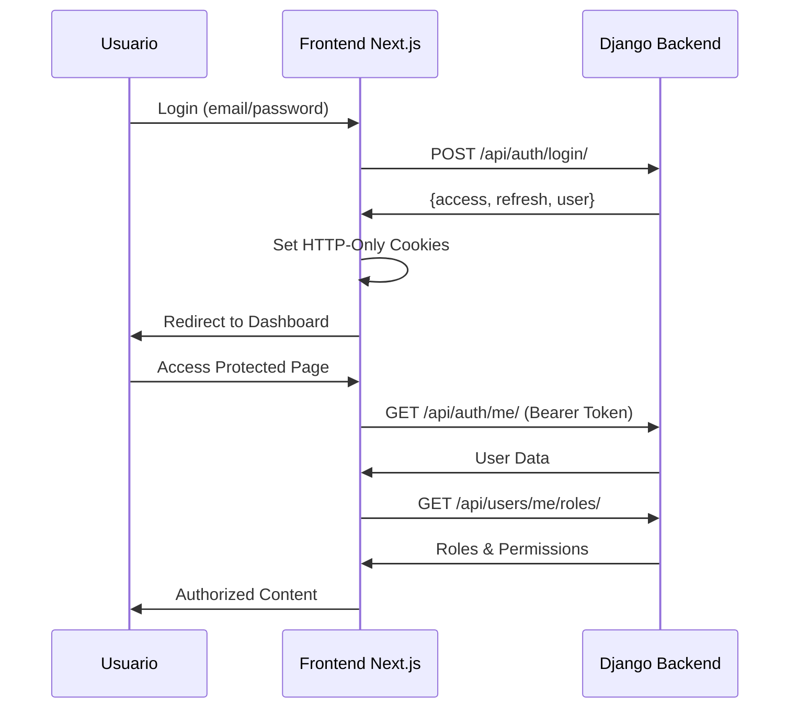

# 📚 Índice de Documentación - JLA Colaboradores Frontend

## 📖 Documentación Principal

### [README.md](../README.md)
Documentación principal del proyecto con información general, instalación, configuración y uso básico.

## 🔧 Guías Técnicas Detalladas

### [Sistema de Roles](./sistema-roles.md)
**Control de Acceso Basado en Roles (RBAC)**
- Arquitectura del sistema de roles
- Implementación con RoleContext
- Funciones de verificación (hasRole, hasAnyRole, isAdmin)
- Integración con Django backend
- Ejemplos prácticos de uso
- Casos de uso comunes y mejores prácticas

### [Integración Django](./integracion-django.md) 
**Backend Django con JWT Authentication**
- Configuración completa de Django REST Framework
- Implementación de JWT con SimpleJWT
- Modelos de Usuario y Roles
- Vistas y serializers
- Proxy endpoints de Next.js
- Configuración de CORS y seguridad
- Testing y deployment

### [Recuperación de Contraseña](./recuperacion-password.md)
**Sistema Completo de Password Reset**
- Flujo completo de recuperación con tokens
- Validación de tokens seguros con expiración
- Envío de emails con enlaces de recuperación
- Validaciones de complejidad de contraseña
- Implementación Django con modelos y vistas
- Templates de email profesionales
- Mejores prácticas de seguridad

### [Herramientas de Debug](./debugging.md)
**Debugging y Desarrollo**
- Páginas de debug disponibles (/debug, /test-login, /roles-debug)
- Endpoints de debugging
- Sistema de logging estructurado
- Herramientas de red y performance
- Troubleshooting común
- Best practices para debugging

### [Endpoints JWT](./jwt-endpoints.md)
**Documentación de APIs JWT** 
- Estructura de endpoints de autenticación
- Formatos de request/response
- Manejo de tokens y cookies
- Códigos de error y debugging

### [Debug Django 400](./debug-django-400.md)
**Resolución de Errores Específicos**
- Debugging de errores 400 con Django
- Problemas comunes de integración
- Soluciones paso a paso

## 🎯 Guías de Uso Rápido

### Configuración Inicial

```bash
# 1. Clonar e instalar
git clone <repo>
cd frontend
npm install

# 2. Configurar backend Django
npm run setup:backend

# 3. Iniciar desarrollo
npm run dev
```

### Configuración Django Backend

```bash
# Backend Django esperado en:
http://localhost:8000/api

# Endpoints requeridos:
POST /api/auth/login/      # Login
GET  /api/auth/me/         # Usuario actual  
GET  /api/users/me/roles/  # Roles del usuario
POST /api/auth/refresh/    # Refresh token
```

### Testing Rápido

```bash
# Páginas de debug
http://localhost:3000/debug       # Estado general
http://localhost:3000/test-login  # Test de login
http://localhost:3000/roles-debug # Verificar roles
```

## 🏗️ Arquitectura del Proyecto

```
frontend/
├── app/                    # Next.js App Router
│   ├── api/               # Proxy endpoints a Django
│   ├── debug/             # Páginas de debugging
│   ├── roles-debug/       # Debug del sistema de roles
│   └── dashboard/         # Área protegida
├── components/ui/         # Componentes reutilizables
├── context/              # Context API
│   ├── AuthContext.tsx   # Autenticación
│   └── RoleContext.tsx   # Sistema de roles
├── lib/                  # Utilidades
│   ├── api.ts           # Cliente API
│   ├── config.ts        # Configuración
│   └── types/           # Tipos TypeScript
├── docs/                # Documentación técnica
└── scripts/             # Scripts de configuración
```

## 🔐 Flujo de Autenticación



## 🎭 Sistema de Roles

### Funciones Principales

| Función | Descripción | Ejemplo |
|---------|-------------|---------|
| `hasRole(role)` | Verificar rol específico | `hasRole('admin')` |
| `hasAnyRole(roles[])` | Verificar múltiples roles | `hasAnyRole(['admin', 'mod'])` |
| `isAdmin()` | Es administrador | `isAdmin()` |
| `isSuperuser()` | Es superusuario | `isSuperuser()` |

### Uso en Componentes

```typescript
import { useRoles } from '@/context/RoleContext'

const MyComponent = () => {
  const { hasRole, isAdmin } = useRoles()
  
  if (!isAdmin()) return <Unauthorized />
  
  return (
    <div>
      {hasRole('admin') && <AdminPanel />}
      {hasRole('moderator') && <ModPanel />}
    </div>
  )
}
```

## 🐛 Debug y Troubleshooting

### Problemas Comunes

1. **CORS Errors** → Verificar `CORS_ALLOWED_ORIGINS` en Django
2. **Cookies no se establecen** → Comprobar dominio y SameSite
3. **401 Unauthorized** → Verificar tokens y headers Authorization
4. **Roles no cargan** → Comprobar autenticación y endpoint Django

### Herramientas de Debug

- **Console Logging**: Sistema estructurado con categorías
- **Network Inspector**: Monitorear requests HTTP
- **Debug Endpoints**: APIs específicas para debugging
- **Debug Pages**: Interfaces visuales para testing

## 🚀 Deployment

### Variables de Entorno

```env
# Desarrollo
NEXT_PUBLIC_API_URL=http://localhost:8000/api

# Producción  
NEXT_PUBLIC_API_URL=https://api.tudominio.com/api
```

### Scripts de Build

```bash
npm run build    # Compilar para producción
npm start       # Ejecutar build compilado
npm run lint    # Verificar código
```

## 📞 Soporte

Para problemas específicos:

1. **Consultar docs relevantes** en esta carpeta
2. **Usar páginas de debug** para diagnosticar
3. **Revisar logs** en consola del navegador
4. **Verificar configuración** con `npm run config:show`

---

**Última actualización:** Octubre 2025  
**Versión del proyecto:** Next.js 15.5.4 + Django Backend  
**Estado:** Producción Ready con sistema completo de autenticación y roles