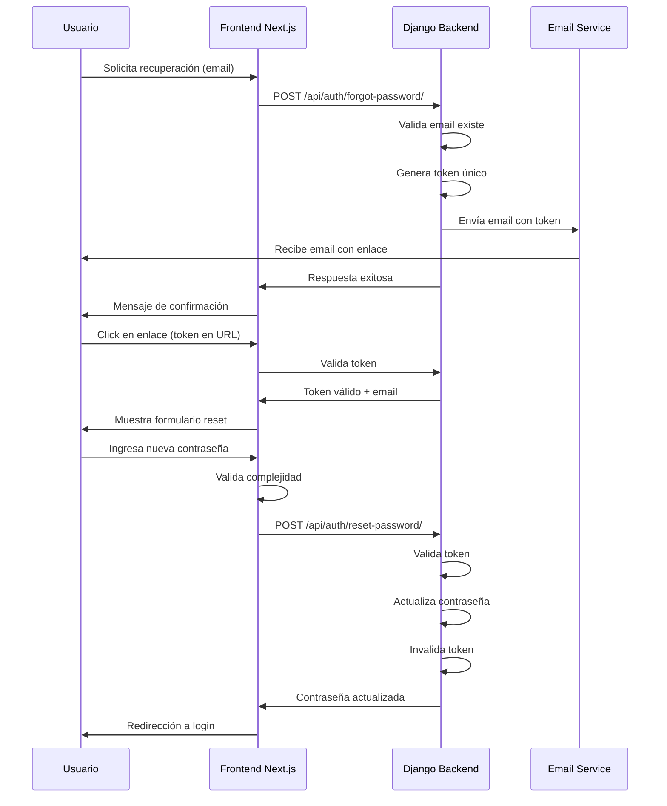

# 🔑 Sistema de Recuperación de Contraseña

## Introducción

Sistema completo de recuperación de contraseña olvidada que integra Next.js con un backend Django. El flujo incluye validación de email, generación de token seguro, envío de correo electrónico y restablecimiento de contraseña con validación de complejidad.

## 🔄 Flujo Completo del Sistema



## 📡 Endpoints del Sistema

### 1. Solicitar Recuperación

**Frontend:** `POST /api/auth/forgot-password`  
**Backend Django:** `POST /api/auth/forgot-password/`

**Request:**
```json
{
  "email": "usuario@ejemplo.com"
}
```

**Response Success:**
```json
{
  "success": true,
  "message": "Si el email existe en nuestro sistema, recibirás un enlace de recuperación"
}
```

**Response Error:**
```json
{
  "success": false,
  "error": "El formato del email no es válido"
}
```

### 2. Validar Token

**Frontend:** `GET /api/auth/validate-reset-token?token=xxx`  
**Backend Django:** `POST /api/auth/validate-reset-token/`

**Request:**
```json
{
  "token": "abc123def456..."
}
```

**Response Success:**
```json
{
  "valid": true,
  "email": "usuario@ejemplo.com"
}
```

**Response Error:**
```json
{
  "valid": false,
  "error": "Token inválido o expirado"
}
```

### 3. Restablecer Contraseña

**Frontend:** `POST /api/auth/reset-password`  
**Backend Django:** `POST /api/auth/reset-password/`

**Request:**
```json
{
  "token": "abc123def456...",
  "new_password": "NuevaContraseña123",
  "confirm_password": "NuevaContraseña123"
}
```

**Response Success:**
```json
{
  "success": true,
  "message": "Contraseña restablecida exitosamente"
}
```

**Response Error:**
```json
{
  "success": false,
  "error": "Las contraseñas no coinciden"
}
```

## 🏗️ Implementación Frontend

### Estructura de Archivos

```
app/
├── forgot-password/
│   └── page.tsx                           # Página de solicitud
├── reset-password/
│   └── [token]/
│       └── page.tsx                       # Página de reset con validación
├── api/
│   └── auth/
│       ├── forgot-password/route.ts       # Proxy a Django
│       ├── validate-reset-token/route.ts  # Validación de token
│       └── reset-password/route.ts        # Reset de contraseña
lib/
├── api.ts                                 # Cliente API con funciones
└── types/
    └── password-reset.ts                  # Tipos TypeScript
```

### Tipos TypeScript

```typescript
// lib/types/password-reset.ts
export interface ForgotPasswordRequest {
  email: string
}

export interface ForgotPasswordResponse {
  success: boolean
  message: string
  error?: string
}

export interface ResetPasswordRequest {
  token: string
  new_password: string
  confirm_password: string
}

export interface ValidateTokenResponse {
  valid: boolean
  email?: string
  error?: string
}
```

### Funciones API

```typescript
// lib/api.ts
export const authAPI = {
  // Solicitar recuperación
  async forgotPassword(email: string): Promise<ApiResponse> {
    const response = await fetchWithCredentials('/api/auth/forgot-password/', {
      method: 'POST',
      body: JSON.stringify({ email }),
    })
    // ... manejo de respuesta
  },

  // Validar token
  async validateResetToken(token: string): Promise<ApiResponse<{ email: string }>> {
    const response = await fetchWithCredentials(
      `/api/auth/validate-reset-token?token=${encodeURIComponent(token)}`
    )
    // ... manejo de respuesta
  },

  // Restablecer contraseña
  async resetPassword(
    token: string, 
    new_password: string, 
    confirm_password: string
  ): Promise<ApiResponse> {
    const response = await fetchWithCredentials('/api/auth/reset-password/', {
      method: 'POST',
      body: JSON.stringify({ token, new_password, confirm_password }),
    })
    // ... manejo de respuesta
  }
}
```

## 🐍 Configuración Django Backend

### Modelos Necesarios

```python
# models.py
from django.db import models
from django.contrib.auth.models import AbstractUser
from django.utils import timezone
import secrets
from datetime import timedelta

class User(AbstractUser):
    email = models.EmailField(unique=True)
    
    USERNAME_FIELD = 'email'
    REQUIRED_FIELDS = ['username']

class PasswordResetToken(models.Model):
    user = models.ForeignKey(User, on_delete=models.CASCADE)
    token = models.CharField(max_length=100, unique=True)
    created_at = models.DateTimeField(auto_now_add=True)
    expires_at = models.DateTimeField()
    used = models.BooleanField(default=False)
    
    def save(self, *args, **kwargs):
        if not self.token:
            self.token = secrets.token_urlsafe(32)
        if not self.expires_at:
            # Token válido por 1 hora
            self.expires_at = timezone.now() + timedelta(hours=1)
        super().save(*args, **kwargs)
    
    def is_valid(self):
        return not self.used and timezone.now() < self.expires_at
    
    def __str__(self):
        return f"Reset token for {self.user.email}"
```

### Vistas de Django

```python
# views.py
from rest_framework.views import APIView
from rest_framework.response import Response
from rest_framework import status
from rest_framework.permissions import AllowAny
from django.core.mail import send_mail
from django.conf import settings
from django.contrib.auth import get_user_model
from .models import PasswordResetToken

User = get_user_model()

class ForgotPasswordView(APIView):
    permission_classes = [AllowAny]
    
    def post(self, request):
        email = request.data.get('email')
        
        if not email:
            return Response({
                'error': 'El email es requerido'
            }, status=status.HTTP_400_BAD_REQUEST)
        
        try:
            user = User.objects.get(email=email)
            
            # Invalidar tokens anteriores
            PasswordResetToken.objects.filter(
                user=user, 
                used=False
            ).update(used=True)
            
            # Crear nuevo token
            reset_token = PasswordResetToken.objects.create(user=user)
            
            # Construir URL de reset
            frontend_url = settings.FRONTEND_URL  # Ej: http://localhost:3000
            reset_url = f"{frontend_url}/reset-password/{reset_token.token}"
            
            # Enviar email
            send_mail(
                subject='Recuperación de Contraseña - JLA Colaboradores',
                message=f'''
Hola {user.first_name or user.username},

Has solicitado restablecer tu contraseña. Haz clic en el siguiente enlace:

{reset_url}

Este enlace expirará en 1 hora.

Si no solicitaste este cambio, ignora este email.

Saludos,
Equipo de JLA
                ''',
                from_email=settings.DEFAULT_FROM_EMAIL,
                recipient_list=[user.email],
                fail_silently=False,
            )
            
            return Response({
                'success': True,
                'message': 'Email de recuperación enviado'
            })
            
        except User.DoesNotExist:
            # Por seguridad, no revelamos si el email existe
            return Response({
                'success': True,
                'message': 'Si el email existe, recibirás un enlace'
            })
        except Exception as e:
            return Response({
                'error': 'Error al enviar email'
            }, status=status.HTTP_500_INTERNAL_SERVER_ERROR)

class ValidateResetTokenView(APIView):
    permission_classes = [AllowAny]
    
    def post(self, request):
        token = request.data.get('token')
        
        if not token:
            return Response({
                'valid': False,
                'error': 'Token no proporcionado'
            }, status=status.HTTP_400_BAD_REQUEST)
        
        try:
            reset_token = PasswordResetToken.objects.get(token=token)
            
            if not reset_token.is_valid():
                return Response({
                    'valid': False,
                    'error': 'Token expirado o ya usado'
                }, status=status.HTTP_400_BAD_REQUEST)
            
            return Response({
                'valid': True,
                'email': reset_token.user.email
            })
            
        except PasswordResetToken.DoesNotExist:
            return Response({
                'valid': False,
                'error': 'Token inválido'
            }, status=status.HTTP_400_BAD_REQUEST)

class ResetPasswordView(APIView):
    permission_classes = [AllowAny]
    
    def post(self, request):
        token = request.data.get('token')
        new_password = request.data.get('new_password')
        
        if not token or not new_password:
            return Response({
                'error': 'Token y contraseña son requeridos'
            }, status=status.HTTP_400_BAD_REQUEST)
        
        # Validar longitud mínima
        if len(new_password) < 8:
            return Response({
                'error': 'La contraseña debe tener al menos 8 caracteres'
            }, status=status.HTTP_400_BAD_REQUEST)
        
        try:
            reset_token = PasswordResetToken.objects.get(token=token)
            
            if not reset_token.is_valid():
                return Response({
                    'error': 'Token expirado o ya usado'
                }, status=status.HTTP_400_BAD_REQUEST)
            
            # Actualizar contraseña
            user = reset_token.user
            user.set_password(new_password)
            user.save()
            
            # Marcar token como usado
            reset_token.used = True
            reset_token.save()
            
            return Response({
                'success': True,
                'message': 'Contraseña restablecida exitosamente'
            })
            
        except PasswordResetToken.DoesNotExist:
            return Response({
                'error': 'Token inválido'
            }, status=status.HTTP_400_BAD_REQUEST)
        except Exception as e:
            return Response({
                'error': 'Error al restablecer contraseña'
            }, status=status.HTTP_500_INTERNAL_SERVER_ERROR)
```

### URLs de Django

```python
# urls.py
from django.urls import path
from . import views

urlpatterns = [
    path('auth/forgot-password/', views.ForgotPasswordView.as_view(), name='forgot-password'),
    path('auth/validate-reset-token/', views.ValidateResetTokenView.as_view(), name='validate-reset-token'),
    path('auth/reset-password/', views.ResetPasswordView.as_view(), name='reset-password'),
    # ... otras rutas
]
```

### Configuración de Email en Django

```python
# settings.py

# Email Configuration (Gmail example)
EMAIL_BACKEND = 'django.core.mail.backends.smtp.EmailBackend'
EMAIL_HOST = 'smtp.gmail.com'
EMAIL_PORT = 587
EMAIL_USE_TLS = True
EMAIL_HOST_USER = os.getenv('EMAIL_HOST_USER')  # tu-email@gmail.com
EMAIL_HOST_PASSWORD = os.getenv('EMAIL_HOST_PASSWORD')  # app password
DEFAULT_FROM_EMAIL = 'JLA Colaboradores <noreply@jla.com>'

# Frontend URL para construir enlaces
FRONTEND_URL = os.getenv('FRONTEND_URL', 'http://localhost:3000')

# Para desarrollo, puedes usar console backend
# EMAIL_BACKEND = 'django.core.mail.backends.console.EmailBackend'
```

## 🔐 Seguridad

### Mejores Prácticas Implementadas

1. **Tokens Seguros**: Generados con `secrets.token_urlsafe(32)`
2. **Expiración**: Tokens válidos solo por 1 hora
3. **Un Uso**: Tokens se invalidan después de usarse
4. **No Revelación**: No se revela si un email existe en el sistema
5. **Validación de Complejidad**: Contraseñas deben tener:
   - Mínimo 8 caracteres
   - Mayúsculas y minúsculas
   - Al menos un número

### Validaciones Frontend

```typescript
// Validación de complejidad en tiempo real
const hasUpperCase = /[A-Z]/.test(password)
const hasLowerCase = /[a-z]/.test(password)
const hasNumbers = /\d/.test(password)
const isLongEnough = password.length >= 8

const isValidPassword = hasUpperCase && hasLowerCase && hasNumbers && isLongEnough
```

## 🎨 UI/UX

### Estados de la Interfaz

1. **Solicitud de Recuperación** (`/forgot-password`)
   - Formulario simple con email
   - Mensaje de confirmación
   - Opción para reenviar

2. **Validando Token** (`/reset-password/[token]`)
   - Loading spinner mientras valida
   - Mensaje de error si token inválido
   - Opción para solicitar nuevo token

3. **Formulario de Reset**
   - Inputs de contraseña con validación visual
   - Indicadores de complejidad en tiempo real
   - Confirmación de contraseña

4. **Éxito**
   - Mensaje de confirmación
   - Redirección automática a login
   - Botón para ir inmediatamente

### Indicadores Visuales

```tsx
{password && (
  <div className="mt-2 space-y-1">
    <div className="flex items-center text-xs">
      <span className={password.length >= 8 ? 'text-green-600' : 'text-gray-400'}>
        {password.length >= 8 ? '✓' : '○'} Al menos 8 caracteres
      </span>
    </div>
    <div className="flex items-center text-xs">
      <span className={/[A-Z]/.test(password) ? 'text-green-600' : 'text-gray-400'}>
        {/[A-Z]/.test(password) ? '✓' : '○'} Una letra mayúscula
      </span>
    </div>
    {/* ... más indicadores */}
  </div>
)}
```

## 🧪 Testing

### Testing Manual

```bash
# 1. Solicitar recuperación
curl -X POST http://localhost:3000/api/auth/forgot-password \
  -H "Content-Type: application/json" \
  -d '{"email": "usuario@ejemplo.com"}'

# 2. Validar token (copiar del email)
curl "http://localhost:3000/api/auth/validate-reset-token?token=TOKEN_AQUI"

# 3. Restablecer contraseña
curl -X POST http://localhost:3000/api/auth/reset-password \
  -H "Content-Type: application/json" \
  -d '{
    "token": "TOKEN_AQUI",
    "new_password": "NuevaPass123",
    "confirm_password": "NuevaPass123"
  }'
```

### Casos de Prueba

- ✅ Email no existe → Respuesta genérica
- ✅ Token inválido → Error apropiado
- ✅ Token expirado → Error apropiado
- ✅ Token ya usado → Error apropiado
- ✅ Contraseña débil → Error de validación
- ✅ Contraseñas no coinciden → Error de validación
- ✅ Flujo completo exitoso → Contraseña actualizada

## 📧 Templates de Email

### Email de Recuperación

```html
<!DOCTYPE html>
<html>
<head>
    <style>
        body { font-family: Arial, sans-serif; line-height: 1.6; color: #333; }
        .container { max-width: 600px; margin: 0 auto; padding: 20px; }
        .button { 
            display: inline-block; 
            padding: 12px 24px; 
            background-color: #d2212b; 
            color: white; 
            text-decoration: none; 
            border-radius: 4px; 
        }
        .footer { margin-top: 30px; font-size: 12px; color: #666; }
    </style>
</head>
<body>
    <div class="container">
        <h2>Recuperación de Contraseña</h2>
        <p>Hola {{ user.first_name }},</p>
        <p>Has solicitado restablecer tu contraseña. Haz clic en el siguiente botón:</p>
        <p style="text-align: center; margin: 30px 0;">
            <a href="{{ reset_url }}" class="button">Restablecer Contraseña</a>
        </p>
        <p>O copia y pega este enlace en tu navegador:</p>
        <p style="word-break: break-all; background: #f5f5f5; padding: 10px; border-radius: 4px;">
            {{ reset_url }}
        </p>
        <p><strong>Este enlace expirará en 1 hora.</strong></p>
        <p>Si no solicitaste este cambio, puedes ignorar este email de forma segura.</p>
        <div class="footer">
            <p>Saludos,<br>Equipo de JLA Colaboradores</p>
        </div>
    </div>
</body>
</html>
```

## 🚨 Troubleshooting

### Email no se envía

**Problema:** Email no llega

**Soluciones:**
1. Verificar configuración SMTP en Django settings
2. Revisar logs de Django para errores
3. Comprobar que EMAIL_HOST_USER y EMAIL_HOST_PASSWORD están configurados
4. Para Gmail, usar App Password, no contraseña normal
5. En desarrollo, usar console backend para debugging

### Token siempre inválido

**Problema:** Validación de token falla

**Soluciones:**
1. Verificar que el token se copia correctamente
2. Comprobar zona horaria en Django (settings.USE_TZ)
3. Revisar tiempo de expiración (1 hora por defecto)
4. Verificar que el token no se haya usado ya

### Contraseña no se actualiza

**Problema:** Reset completa pero contraseña no cambia

**Soluciones:**
1. Asegurar que se usa `user.set_password(new_password)` no `user.password = ...`
2. Verificar que se llama `user.save()` después
3. Comprobar que el token se marca como usado

---

Este sistema proporciona un flujo completo y seguro de recuperación de contraseña siguiendo las mejores prácticas de la industria.